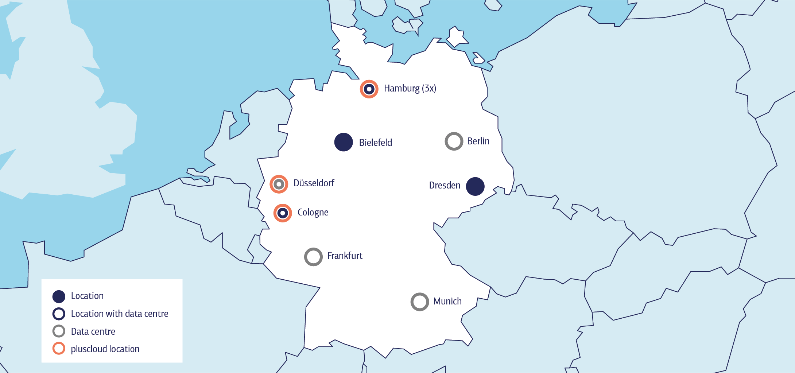

# Introduction

PlusServer offers multiple regions and availability zones (AZs) to provide customers with high availability and disaster recovery options. Each AZ consists of one or more data centers that are designed to be independent of one another, providing redundancy in case of failures or disasters. Customers can choose to deploy their resources in one or multiple AZs for high availability and disaster recovery purposes.

## What is a Region?

A region is a geographic area that consists of several isolated and physically separated, thus redundant, AZs.

### Requirements

* Consists of several isolated and physically separated, AZs within a geographical area.
* Distance between regions is >=300km.

### Examples

* DE-WEST

## What is an Availability Zone (AZ)?

An availability zone (AZ) is a location within a region consisting of one or more data centers designed to be independent of one another, providing redundancy in case of failures or disasters. Customers can choose to deploy their resources in one or multiple AZs for high availability and disaster recovery purposes.

### Requirements

* Located within a region and consists of one or more data centers with at least one common power, network, and cooling supply.
* An AZ is always independent of another (especially in the areas of power [input, distribution, UPS, emergency power], network [input, router, switches], cooling, and buildings).
* Latency between the AZs within the same region is <=2ms

### Examples

* DE-NORTH-1
* DE-WEST-2

## PlusServer Region and Availability Zone List

The following table lists the regions and AZs offered by PlusServer:

| Region   | Availability Zone | Location            |
|----------|-------------------|---------------------|
| DE-NORTH | DE-NORTH-1        | Hamburg, Germany    |
|          | DE-NORTH-2        | Hamburg, Germany    |
| DE-WEST  | DE-WEST-1         | Cologne, Germany    |
|          | DE-WEST-2         | Dusseldorf, Germany |

### Locations and data centers

