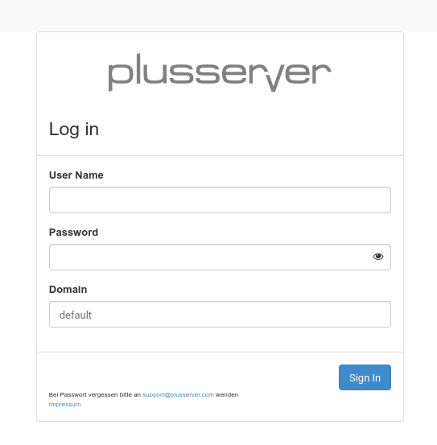
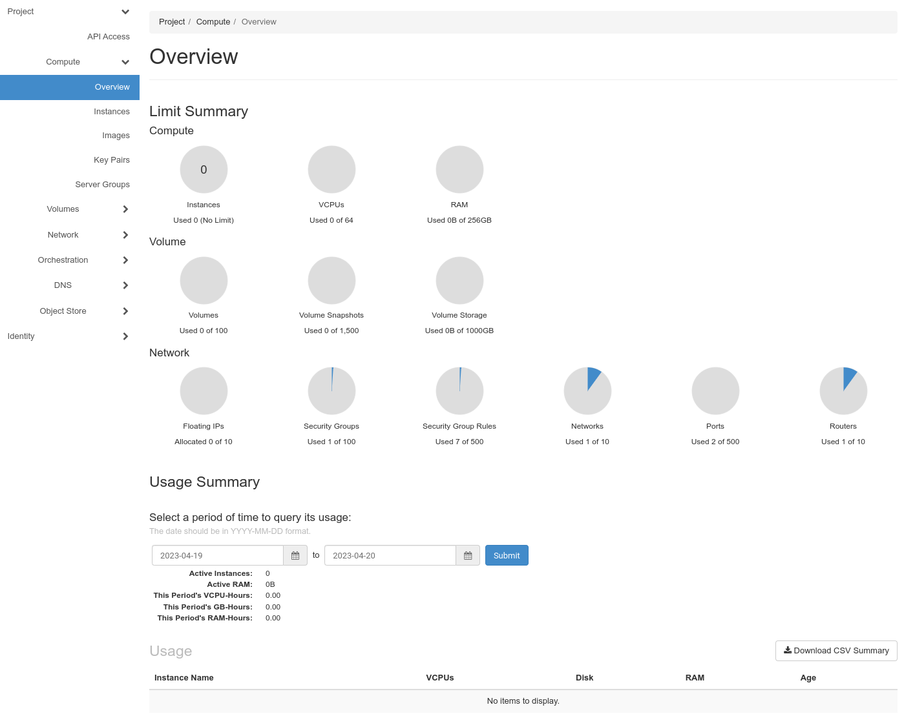
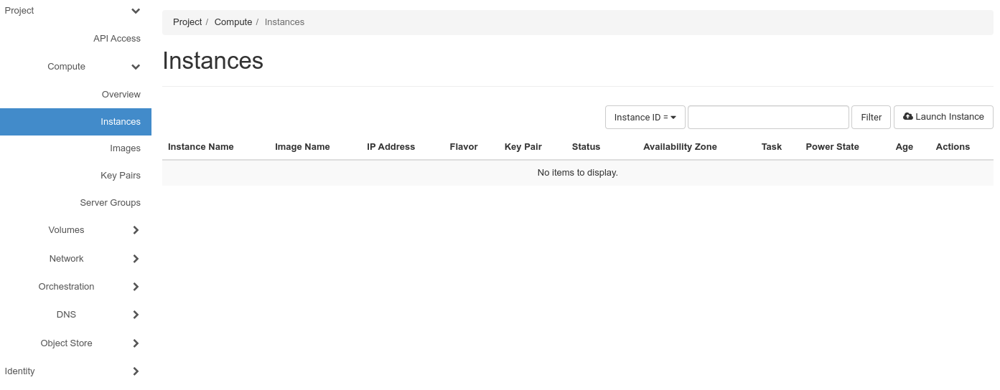
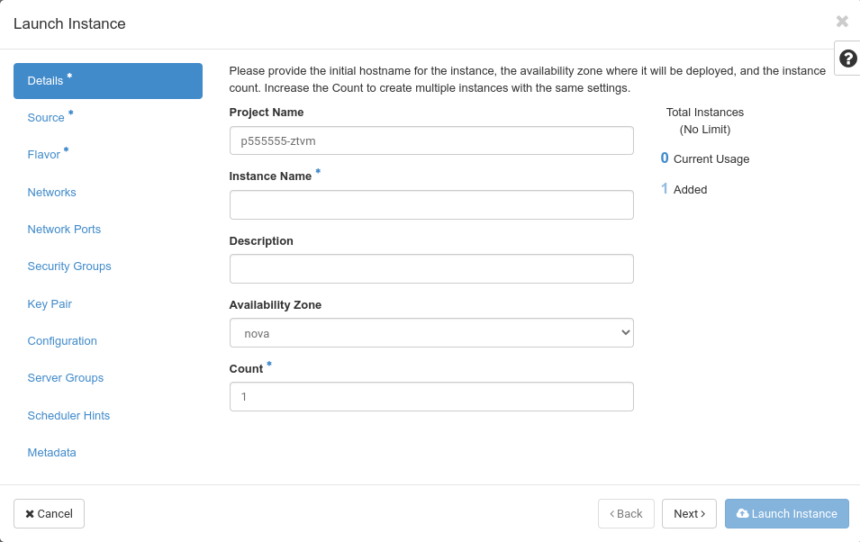

---
#https://gohugo.io/content-management/page-bundles/
title: "From zero to first login into a VM with Horizon"
date: 2023-03-20
description: >
  Click your first VM in Horizon and log in
---

## Your get your credentials via E-Mail

After ordering a cloud in one of our regions, you'll receive an e-mail similar to the following:

    Liebe Kundin, lieber Kunde,
    
    Ihre pluscloudopen d123456 ist nun verfügbar unter https://prod1.api.pco.get-cloud.io/
    Zugangsdaten:REGION=prod1
    DOMAIN_NAME=d123456
    PROJECT_NAME=p123456-ztvm
    USERNAME=u123456-projectadm
    PWX_LINK=https://pwx.psmanaged.com/link/agp4513256
    Mit freundlichen Grüßen,
    Ihr pluscloudopen Team.

This e-mail includes all information you need to connect to pluscloud open for the first time.

Clicking on ``https://prod1.api.pco.get-cloud.io/`` will open a new tab in your browser and take you to the login screen of pluscloud open.

Now you can make use of the information from the e-mail. You can acquire your "**Password**" by clicking on the "PWX_LINK". This will lead you to a webpage with another link, which you should click on to get the password for the user. We do that to work around anti-virus software, which follows links in your e-mails and would render a password link invalid. 

Enter the "USERNAME" value from the e-mail in the "**User Name**" field, use the password from the "PWX_LINK" for the "**Password**" field and try the "DOMAIN_NAME" for the "**Domain**" field.

Click on "Sign In" and you should be logged in to the web gui of pluscloud open.

## Your first Instance

In order to start you first instance on pluscloud open you should click on "**Instances**". That should bring you to the "Instances" menu

As you can see, there are currently no instances deployed. To start your first instance, click on "**Launch Instance**". 
That opens a pop-up, which will guide you through all required steps creating and starting a new instance.

Asterisks (*) mark required information

