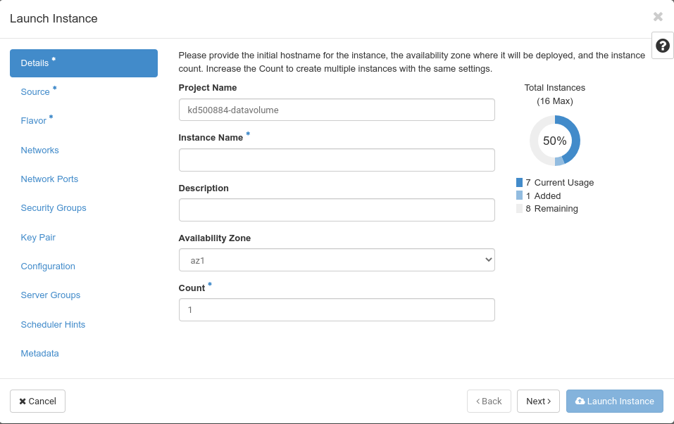

## Launch Instance
Using the button "Launch Instance" you can create one or more new instances and start them. An guided dialogue helps you to go through all required steps. As soon as you have entered enough information for launching an instance the button "Create Instance" becomes available and you can start your new instance(s). Asterisks (*) mark required information.

Keep in mind that shell access to the new instance is only possible via ssh key authentication. Thus you either need to create a ssh keypair during instance creation or upload your keypair beforehand. 
Clicking on "**Launch Instance**" opens a dialogue, which will guide you through several steps, which have to be completed to launch an instance:

As usual Asterisks (*) mark required information and as soon as enough information has been entered, the "**Launch instance**" button will be activated.

You need to give your new instance a name in the "**Instance Name**" field. The description is optional. There is only one "**Availability Zone**" you can choose. You can use the "**Count**" field to spawn serveral instances of the same type at the same time.
