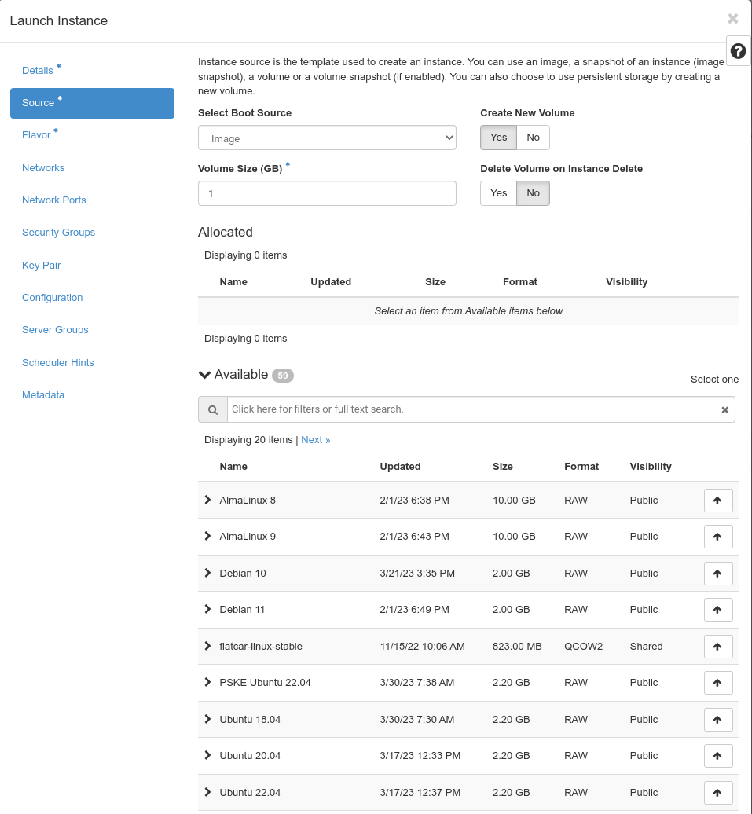
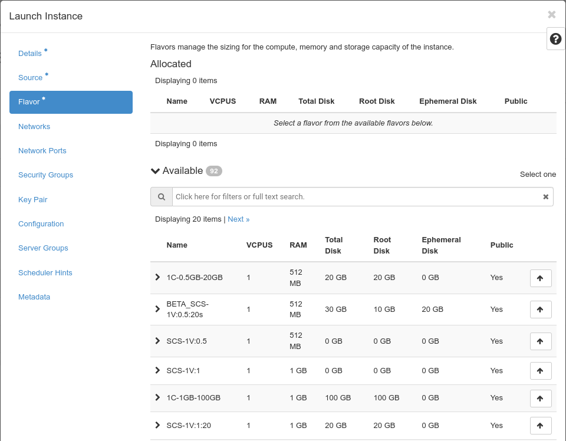

## Launch Instance
Using the button "Launch Instance" you can create one or more new instances and start them. An guided dialogue helps you to go through all required steps. As soon as you have entered enough information for launching an instance the button "Create Instance" becomes available and you can start your new instance(s). Asterisks (*) mark required information.

Keep in mind that shell access to the new instance is only possible via ssh key authentication. Thus you either need to create a ssh keypair during instance creation or upload your keypair beforehand. 
Clicking on "**Launch Instance**" opens a dialogue, which will guide you through several steps, which have to be completed to launch an instance:

As usual Asterisks (*) mark required information and as soon as enough information has been entered, the "**Launch instance**" button will be activated.

You need to give your new instance a name in the "**Instance Name**" field. The description is optional. There is only one "**Availability Zone**" you can choose. You can use the "**Count**" field to spawn serveral instances of the same type at the same time.

"Next" you should define the "**Source**" of your instance. Basically you choose, what image your instance should be based on. 

First you choose whether your new instance should be booted from an image (and you see a list of the items available to you under "**Available**"), from an instance snapshot, from a volume or from a volume snapshot. If you choose an existing volume, you can only boot one instance from it. If you choose an image or a snapshot, you can boot more than one instance from it. You choose the item you want by clicking on on the little "up" arrow on the right.

Next you define the "**Volume Size**" of the root volume of your new instance. If you set no value here (or one which is too small), the size will automatically adjusted to the size of the image you choose. 

The options on the right side ("**Create New Volume**" and "**Delete Volume on Instance Delete**") determine the lifecycle of the root volume of your instance. If you want, that your instance and its root volume are deleted when the instance is deleted, you should choose not to create a new volume (the option to delete the volume on instance delete will be deactivated). If you have chosen to create a volume, you can choose to have the volume deleted on instance deletion. If you don't choose this option, the root volume of the instance will "survive" the deletion of the instance (and consume storage and be billed).

Now - by clicking on "Next" - you have to choose the "**Flavor**" of your new instance. "Flavors" determine the "dimensions" of your new instance regarding the number of virtual CPUs, the amount of virtual memory and the size of the root disk. 

Clicking on the little arrow on the left - in front of each flavor line - shows what impact the choice of that flavor has on your consumption. By clicking on the "up" arrow you choose to use the flavor for the instance creation. If the choice of a flavor would consume more resources than available in your quota, it is marked with a yellow "warning" exclamation mark.

Pluscloud open is in charge of the creation an management of the flavors.

