## Networking
For your convenience new projects in pluscloud open are created with a preconfigured network setup, which contains a private network and a router, which connects that private network to the internet. All networking configuration in Horizon is done in the "Network" menu.

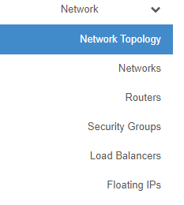

"**Network Topology**" gives you a diagram of your current network setup. "**Networks**" lists all currently configured networks in your project and allows you to manage existing, delete existing and create new networks. "**Routers**" lists all configured routers in your project and allow management, creation and deletion of routers. "**Security Groups**" are basically firewall rules which are used to allow or deny traffic to or from your infrastructure. "**Load Balancers**" lets you create, delete and manage loadbalancers, members, pools in your environment. "**Floating IPs" lets you manage, attach, detach, acquire public IP addresses for your instances.

### Network Topology
In the network topology menu entry you can get an overview about the networking setup inside your project. The diagram shows your current setup and is updated with every change of the environment. 

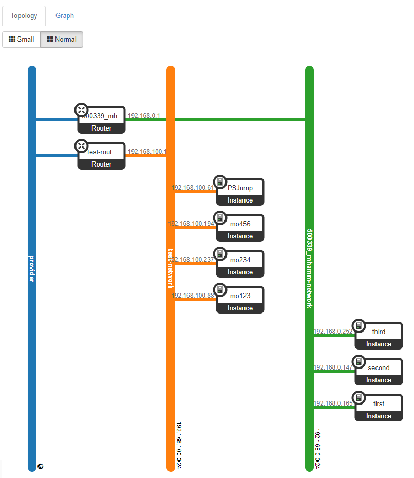

The above diagram shows two private networks which are connected to a public network ("provider network" in OpenStack language) with two routers. Hovering with your mouse over the elements of the diagram shows more information and shortcuts to other functions of the web gui.

### Networks
Under "Networks" you find the configured networks in your environment and you can manage, add or delete networks.
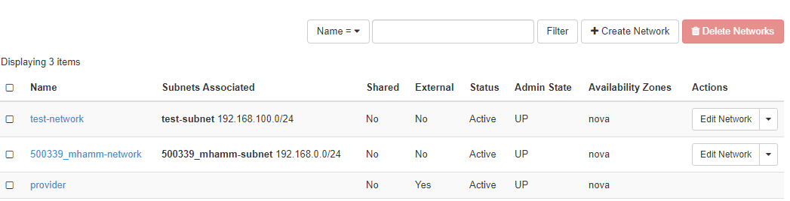

Each network needs an associated subnet - which is set up during network creation, too. The external network - "ext01" in case of pluscloud open - is configured by the provider and cannot be changed.

#### Create networks
Klicking on "Create network" brings up a dialogue to define a new network. 

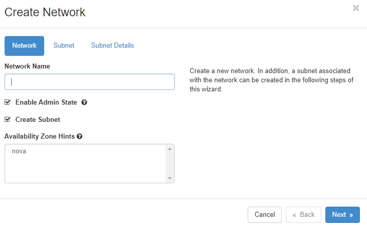 

You need to give the new network a name, decide if it should receive traffic (by klicking "Enable Admin State") and decide if you want to create a new subnet in the new network or use an existing one. The "Availability Zone Hints" currently refers to all of the respective pluscloud open environment as there is only one availability zone per pluscloud open environment.

If you chose "Create Subnet" you have to define the subnet as the next step. 

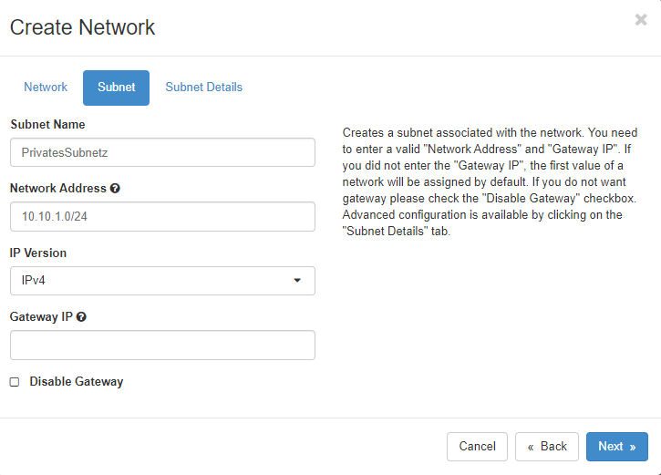  

Here you create a subnet which is associated with the new network. You need a valid "Network Address" of a [RFC1918](https://www.rfc-editor.org/rfc/rfc1918) network in [CIDR](https://en.wikipedia.org/wiki/Classless_Inter-Domain_Routing) notation. If you don't specify a "Gateway IP" the first IP address of the subnet will automatically become the gateway IP address. If you don't want a gateway in your network, klick on "Disable Gateway". 

A detailed configuration of the subnet is available in the "Subnet Details" menu.

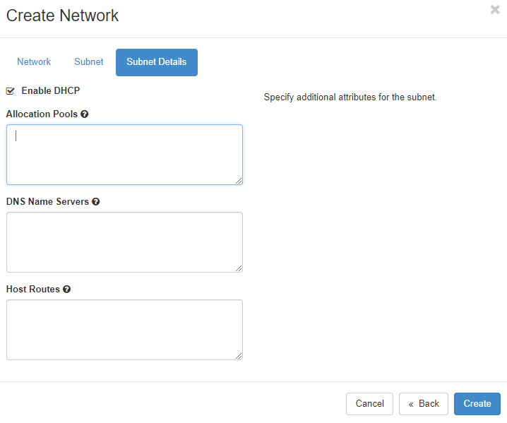

Here you can define, whether [DHCP](https://en.wikipedia.org/wiki/Dynamic_Host_Configuration_Protocol) should be available in the subnet. If you want, you can further specify the subnet pool from where DHCP addresses should be allocated. Allocation pools should at least start with the .5 address because there could be other network services already running on those first addresses of the network.
If you want to use specific nameservers for your network, you can define them in the "DNS Name Servers" field. Specific host routes to specific networks can be set in the "Host Routes" field, where you define the destination network in CIDR notation followed by the gateway IP address over which you can reach the destination network.
Click on "Create" to let OpenStack provision the new network and subnetwork.

## Router
Networks need to be connected by routers in order to be able to communicate. This is true for external networks as well as internal networks.

### Routers
The "Routers" menu lists all configured routers, allows the management and deletion of those routers and the creation of new ones.
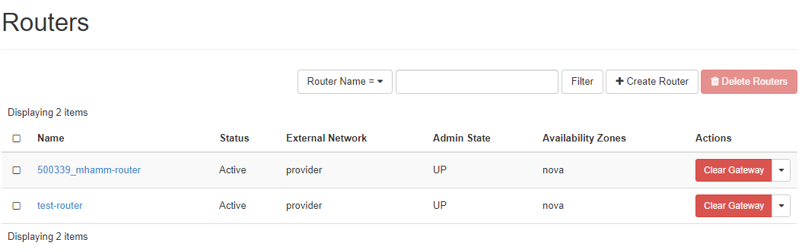

### Create Router
To create a new router click on "Create Router", give it a name, allow it to route packets by clicking on "Enable Admin State" and select an "External Network" from the list.
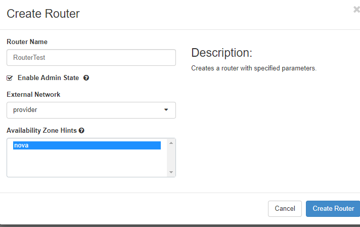

### Add Interface
Cicking on the name of an already existing router, you see the current interfaces and their configuration

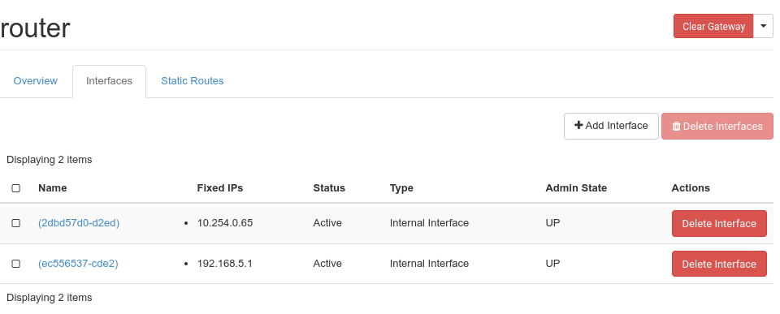

If you click on "Add Interface" you can choose which subnet you want the route to be connected to and which ip address the new router interface should get. 

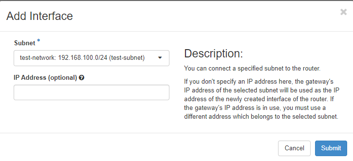

### Add Static Route

Clicking on the "Static Routes" tab, you can add static routes to your router

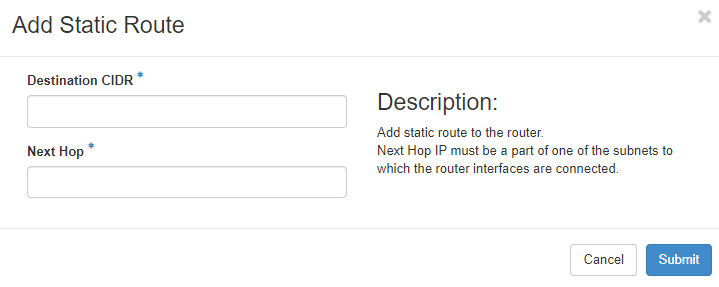

Add the destination network in CIDR notation and define a reachable IP address for the router to connect to the destination network.

## Security Groups