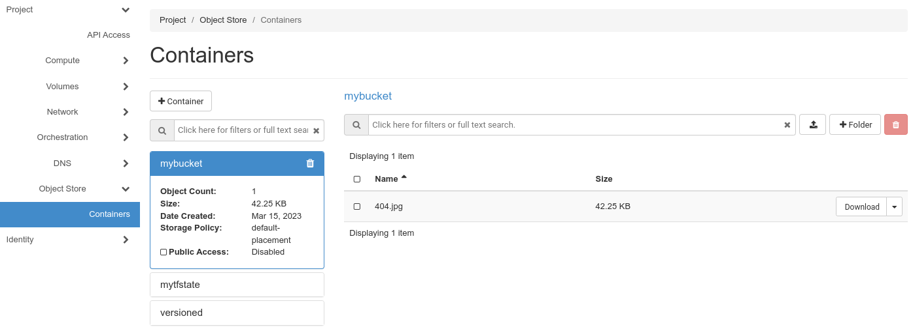
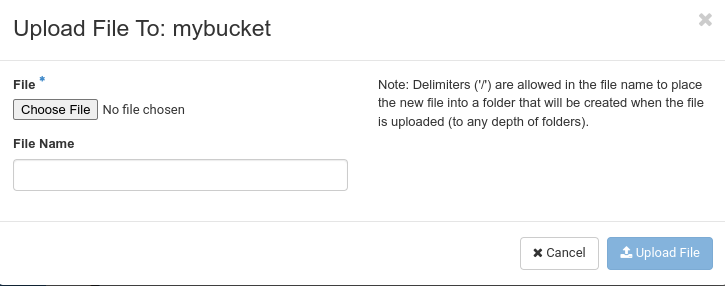

## Overview

Pluscloud open provides [object storage](https://en.wikipedia.org/wiki/Object_storage) compatible to Openstacks [Swift](https://wiki.openstack.org/wiki/Swift) and Amazons [S3](https://docs.aws.amazon.com/AmazonS3/latest/API/Welcome.html) protocols. 
It is basically provided for "cloud native" use cases: 

* as a backend for infrastructure as code scenarios (like backend storage for terraform state files), which can be used by a group of developers.
* as a file/content repository for scale-out scenarios, where cloud instances, spawned from images, would load current content from object storage (instead of mounting an NFS volume, what would be considered as "bad design" in cloud contexts).

## Managing Object Storage

Object Storage is either managed via the web gui or with a CLI client. You find your object storage under "**Object Store**" and then "**Containers**" in your Horizon menu. "Containers" is in Swift what "buckets" is in S3.

You can even up- and download content into your containers/buckets. Just click on the little "upload" button and choose a file from your computer.

then click on "**Upload File**". Objects can be downloaded with the "**Download**" button on the right. But there are other options in that menu.

"**View Details**" gives you some information about that object (like size, content type, etc.). With "**Edit**" you can change the content of that object. But there is no in place editing for object storage - the new content is uploaded with the old object name.

Furthermore you can copy an object into another container/bucket by choosing "**Copy**". "**Delete**" obviously deletes the object.