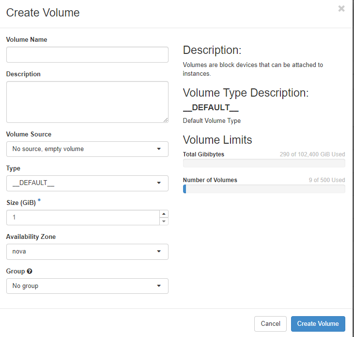

## Volumes

Volumes represent (Block)storage in OpenStack. Volumes are used as disks in instances. If not explicitly mentioned otherwise, volumes reside on a [ceph](https://ceph.io/en/) storage system and are attached to the instance via network using the [RADOS](https://docs.ceph.com/en/quincy/rbd/index.html) protocol.
The "**Volumes**" menu allows you to manage volumes in your project. 

You can create new volumes, backups and snapshots as well as group your volumes (e. g. for snapshotting them at the same time). The list shows the volumes with their unique ID but you can change the name of your volumes, if you like. Furthermore you can see, whether the volume is currently attached to an instance (and where), the size of the volume and whether it is member of a volume group. The "**Actions**" button gives you access to the various management options you have for your volumes.

With "**Edit Volume**" you can change the name of your volume and/or add a description for it. This can be helpful in making the purpose of the volume visible. Furthermore you can set the boot flag for a volume here. Using "**Manage Attachments**" you can attach a volume to an instance or detach it from it. Be aware, that after attaching a volume you most probably have to change some configuration bits on your instance (like put a filesystem on the new volume, edit /etc/fstab and mount it, etc.). Before detaching a volume from your instance, you should umount it.

"**Create Snapshot**" allows you to snapshot the respective volume. You have to give it a name (and an optional description) first. Please be aware, that snapshotting a volume which is mounted and used can lead to data corruption. The safe way to take snapshots is to unmount the respective volume first. Snapshots are not backups.

Using "**Create Backup**" creates a backup of your volume. If you choose a snapshot of your volume, only the snapshot will be backed up. If your volume backup fits into your object store quota, you can choose an object store bucket and write the backup there.

You can convert a volume into an image which you can use to create an instance with "**Upload to Image**". You have to choose a disk format for the image (mostly "raw" or "qcow2"). If the volume is in use you can "force" the backup by clicking on "**Force**".

With "**Update Metadata**" you can manage the volume metadata. You find pre-defined metadata definitions which you can use or you can define custom metadata with the "**Custom**" field. The max length for a single key is 255 characters.

### Create Volume

In order to create a new volume you click on "+Create Volume" and then you are stepped through a few menus to define the new volume

Apart from a name and an optional description you can choose a "**Volume Source**" e. g. an image, a snapshot or other volumes. Depending on your choice the input fields change (but those are selfexplaining). The chosen source determines the size of the new volume. You can assign the volume to a volume "**Group**", that you have defined beforehand.
 